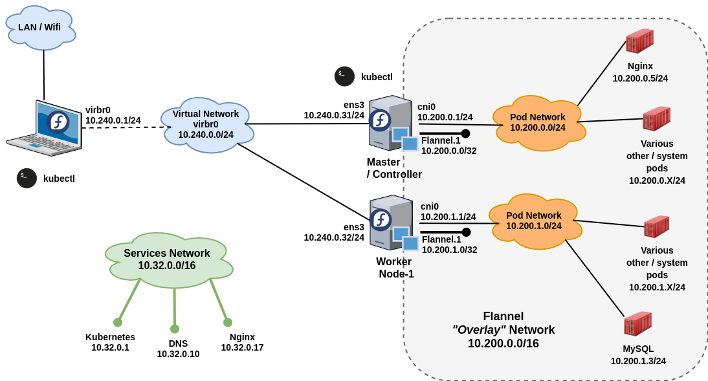

# KubeAdm based kubernetes cluster

Reference documentation: [https://kubernetes.io/docs/setup/independent/install-kubeadm/](https://kubernetes.io/docs/setup/independent/install-kubeadm/)

Kubeadm helps you setup/bootstrap a minimum viable/usable Kubernetes cluster that just works. Kubeadm also supports cluster expansion, upgrades, downgrade, and managing bootstrap tokens, which are extra features, if you are comparing it with minikube.

A video showing kubeadm cluster setup, (in Urdu language), using this guide, is available at: [https://youtu.be/FRvkSlIUimM](https://youtu.be/FRvkSlIUimM)


## Setup / components / look and feel:
The Kubernetes cluster discussed in this guide is a virtual cluster, created using virtual machines running on KVM/Libvirt, on a Fedora 28 host computer.

### KubeAdm cluster overview:
|  |
|:--:|
| *Cluster components overview of a kubeadm based cluster* |


### KubeAdm cluster networks:
|  |
|:--:|
| *Cluster networks involved in a kubeadm based cluster* |

## Features and Limitations:
* Possible to create multi-node kubernetes cluster compared to minikube.
* It creates a single node master. No High Availability for master node available yet.
* You can create/join one or more **dedicated** worker-nodes.
* Being multi-node in nature, allows you to use multi-node features such as [advance scheduling policies](https://kubernetes.io/blog/2017/03/advanced-scheduling-in-kubernetes/).
* Services of type **LoadBalancer** still not possible
* Choice of using different container engines, such as Docker, Rocket, etc. This is not possible in MiniKube.
* Choice of wide variety of (CNI-based) network plugins to be used for pod networking. This is not possible in MiniKube.
* Supports cluster expansion, upgrades, downgrade, etc.
* *Can* be used as a production cluster, though extreme caution is advised. You should know what you are doing!


In this guide, I will setup a single node kubernetes cluster using **kubeadm** and Docker-CE. Once installed, I will add more nodes to the cluster - again using **kubeadm**.


## Preparation:
* **RAM:** Minimum 1 GB RAM for each node (master+worker); you will only be able to run very few (and very small) containers, like nginx, mysql, etc.
* **CPU:** Minimum 2 CPU for master node; worker nodes can live with single core CPUs
* **Disk:** 4 GB for host OS + 20 GB for storing container images. (no swap)
* **Network - Infrastructure:** A functional virtual/physical network with some usable IP addresses (can be public or private) . This can be on any cloud provider as well. You are free to use any network / ip scheme for yourself. In this guide, it will be `10.240.0.0/24`
* **Network - Pod network:** A network IP range completely separate from other two networks, with subnet mask of `/16` or smaller (e.g. `/12`). This network will be subdivided into subnets later. In this guide it will be `10.200.0.0/16` . Please note that kubeadm does not support kubenet, so we need to use one of the CNI add-ons - such as flannel. By default Flannel sets up a pod network `10.244.0.0/16`, which means that we need to pass this pod network to `kubeadm init` (further below); or, modify the flannel configuration with the pod network of our own choice - before actually applying it blindly. :)
* **Network - Service network:** A network IP range completely separate from other two networks, used by the services. This will be considered a completely virtual network. The default service network configured by kubeadm is `10.96.0.0/12`. In this guide, it will be `10.32.0.0/16`.
* **Firewall:** Disable Firewall (including removing the firewalld package), or open the following ports on each type of node, after the OS installation is complete. 
* **Firewall/ports - Master:** Incoming open (22, 6443, 10250, 10251, 10252, 2379, 2380)
* **Firewall/ports - Worker:** Incoming open (22, 10250, 30000-32767)
* **OS:** Any recent version of Fedora/CentOS/RHEL or Debian based OS. This guide uses Fedora 28
* **Disk Partitioning:** No swap - must disable swap partition during OS installation in order for the kubelet to work properly. See: [https://github.com/kubernetes/kubernetes/issues/53533](https://github.com/kubernetes/kubernetes/issues/53533) for details on why disable swap. Swap may seem a good idea, it is not - on Kubernetes!
* **SELinux:** Disable SELinux / App Armour.
* Should have some sort of DNS for infrastructure network.

## OS setup:

```
[root@kworkhorse lib]# cat /etc/hosts
127.0.0.1   localhost localhost.localdomain

 # Virtual Kubernetes cluster
10.240.0.31	kubeadm-node1
10.240.0.32	kubeadm-node2
10.240.0.33	kubeadm-node3
```

```
sudo yum -y remove firewalld

sudo yum -y install ebtables
```

Enable the sysctl setting `net.bridge.bridge-nf-call-iptables`
```
cat <<EOF >  /etc/sysctl.d/k8s.conf
net.bridge.bridge-nf-call-ip6tables = 1
net.bridge.bridge-nf-call-iptables = 1
EOF
sysctl --system
```


### Install container runtime (Docker):
Reference: [https://kubernetes.io/docs/setup/cri/](https://kubernetes.io/docs/setup/cri/)
You can select other runtimes too, such as Rocket (rkt). I will use Docker.

**Note:** DO NOT install docker from default Fedora/CentOS repository, that is a very old version of Docker.

On all nodes (master+worker), install Docker.
```
sudo dnf config-manager \
    --add-repo \
    https://download.docker.com/linux/fedora/docker-ce.repo
```


```
sudo dnf install docker-ce
```

```
sudo systemctl enable docker
sudo systemctl start docker
sudo systemctl status docker
```

### Install kubeadm, kubelet and kubectl:
On each node, install:
* kubeadm: the command to actually setup / bootstrap the cluster.
* kubelet: the component that runs on all of the machines in your cluster and does things like starting pods and containers.
* kubectl: the command line util to talk to your cluster.


All of the above three pieces of software are available from kubernetes's yum repository. So first, set that up:

```
cat <<EOF > /etc/yum.repos.d/kubernetes.repo
[kubernetes]
name=Kubernetes
baseurl=https://packages.cloud.google.com/yum/repos/kubernetes-el7-x86_64
enabled=1
gpgcheck=1
repo_gpgcheck=1
gpgkey=https://packages.cloud.google.com/yum/doc/yum-key.gpg https://packages.cloud.google.com/yum/doc/rpm-package-key.gpg
exclude=kube*
EOF
```

```
sudo sed -i 's/^SELINUX=enforcing$/SELINUX=disabled/' /etc/selinux/config
```

```
yum install -y kubelet kubeadm kubectl --disableexcludes=kubernetes

systemctl enable kubelet && systemctl start kubelet
```

The above command installs additional packages, which are:
* cri-tools  (command line utility to interact with container runtime, such as docker)
* kubernetes-cni (binary files to provision container networking. The files are installed in `/opt/cni/bin`)
* socat  (relay for bidirectional data transfer between two independent data channels, e.g. files, pipe, device, socket, program, etc.)


At this time kubeadm is only *installed* - not *run*. Note that kubelet is set to start. Kubelet will continuously try to start and will fail (crash-loop), because it will wait for kubeadm to tell it what to do. This crashloop is expected and normal. After you initialize your master (using kubeadm), the kubelet runs normally.


## Run kubeadm on node1/master to setup the cluster:

SSH to the master node (node1) - as root, and run `kubeadm init` command. Also make a note of entire output of the `kubeadm init` command. This will be useful later. 

What `kubeadm init` does is, it goes through a series of phases, the first one being **pre-flight checks** , and last one being **installing add-ons**. These phases are shown in square brackets in the beginning of each line of the output generated by the `kubeadm init` command. Most notably, these phases are:

* Pull container images for kubernetes *control plane* (etcd, API server, Controller Manager, Scheduler)
* Setup kublet as systemd service
* Generate self signed SSL certificates for all kubernetes components
* Generate necessary kubeconfig files for components of the *control plane*, and the admin user, to be able to access API server with credentials, certificates, etc
* Create and deploy **static pod** definitions of the *control plane* components directly through **kubelet**. You will see (later) that etcd, api-server, controller-manager and scheduler are deployed as plain pods, without being part of any replication-controller, deployment, or daemon-set. These pods are setup using *host* networking.
* Create **kubelet** configuration as *config-map* in the **kube-system** namespace - as soon as the control plane boots up and reports healthy
* Mark the master as **master**  by adding labels and taints
* Create bootstrap tokens and RBAC rules so various components are able to access each other and do certain things, like automatic approval of CSRs, etc
* Install CoreDNS addon by creating it as a *deployment* - using *pod* networking
* Install kube-proxy addon by creating it as a *daemon-set* - using *host* networking

Complete detail of all these phases can be found here: [https://kubernetes.io/docs/reference/setup-tools/kubeadm/implementation-details/](https://kubernetes.io/docs/reference/setup-tools/kubeadm/implementation-details/)


OK, enought talk! Lets initialize kubeadm!

```
kubeadm init \
  --pod-network-cidr "10.200.0.0/16" \
  --service-cidr "10.32.0.0/16"
```

**Note:** You can skip `--pod-network-cidr` and `--service-cidr` . The default for pod-network is nothing- actually depends on the CNI plugin you will be using; but if you plan to use flannel, **and** want to use flannels *default configuration*, then you must pass `--pod-network-cidr "10.244.0.0/16"` to the `kubeadm init` command . The default for `--service-cidr` is: `10.96.0.0/12`. 


So the first attempt results in the following:
```
[root@kubeadm-node1 ~]# kubeadm init \
>   --pod-network-cidr "10.200.0.0/16" \
>   --service-cidr "10.32.0.0/16"
[init] using Kubernetes version: v1.12.2
[preflight] running pre-flight checks
[preflight] The system verification failed. Printing the output from the verification:
KERNEL_VERSION: 4.18.17-200.fc28.x86_64
CONFIG_NAMESPACES: enabled
CONFIG_NET_NS: enabled
CONFIG_PID_NS: enabled
CONFIG_IPC_NS: enabled
CONFIG_UTS_NS: enabled
CONFIG_CGROUPS: enabled
CONFIG_CGROUP_CPUACCT: enabled
CONFIG_CGROUP_DEVICE: enabled
CONFIG_CGROUP_FREEZER: enabled
CONFIG_CGROUP_SCHED: enabled
CONFIG_CPUSETS: enabled
CONFIG_MEMCG: enabled
CONFIG_INET: enabled
CONFIG_EXT4_FS: enabled
CONFIG_PROC_FS: enabled
CONFIG_NETFILTER_XT_TARGET_REDIRECT: enabled (as module)
CONFIG_NETFILTER_XT_MATCH_COMMENT: enabled (as module)
CONFIG_OVERLAY_FS: enabled (as module)
CONFIG_AUFS_FS: not set - Required for aufs.
CONFIG_BLK_DEV_DM: enabled
DOCKER_VERSION: 18.09.0
OS: Linux
CGROUPS_CPU: enabled
CGROUPS_CPUACCT: enabled
CGROUPS_CPUSET: enabled
CGROUPS_DEVICES: enabled
CGROUPS_FREEZER: enabled
CGROUPS_MEMORY: enabled
[preflight] Some fatal errors occurred:
	[ERROR SystemVerification]: unsupported docker version: 18.09.0
[preflight] If you know what you are doing, you can make a check non-fatal with `--ignore-preflight-errors=...`
[root@kubeadm-node1 ~]# 
```

Of-course I installed the latest docker-ce from the docker repository.

```
[root@kubeadm-node1 ~]# yum list docker-ce
Last metadata expiration check: 6:32:42 ago on Sun 11 Nov 2018 02:39:13 PM CET.
Installed Packages
docker-ce.x86_64                                           3:18.09.0-3.fc28                                            @docker-ce-stable
[root@kubeadm-node1 ~]# 
```

And, I have the following version for kubeadm:

```
[root@kubeadm-node1 ~]# kubeadm version
kubeadm version: &version.Info{Major:"1", Minor:"12", GitVersion:"v1.12.2", GitCommit:"17c77c7898218073f14c8d573582e8d2313dc740", GitTreeState:"clean", BuildDate:"2018-10-24T06:51:33Z", GoVersion:"go1.10.4", Compiler:"gc", Platform:"linux/amd64"}
[root@kubeadm-node1 ~]# 
```


I can downgrade docker to 18.06 , which is certified with kubeadm, but I can try to use docker 18.09 by asking kubeadm to skip this test.

```
[root@kubeadm-node1 ~]# kubeadm init  \
  --pod-network-cidr "10.200.0.0/16" \
  --service-cidr "10.32.0.0/16" \
  --ignore-preflight-errors="SystemVerification"
```


```
[root@kubeadm-node1 ~]# kubeadm init  \
  --pod-network-cidr "10.200.0.0/16" \
  --service-cidr "10.32.0.0/16" \
  --ignore-preflight-errors="SystemVerification"

[init] using Kubernetes version: v1.12.2
[preflight] running pre-flight checks
[preflight] The system verification failed. Printing the output from the verification:
KERNEL_VERSION: 4.18.17-200.fc28.x86_64
CONFIG_NAMESPACES: enabled
CONFIG_NET_NS: enabled
CONFIG_PID_NS: enabled
CONFIG_IPC_NS: enabled
CONFIG_UTS_NS: enabled
CONFIG_CGROUPS: enabled
CONFIG_CGROUP_CPUACCT: enabled
CONFIG_CGROUP_DEVICE: enabled
CONFIG_CGROUP_FREEZER: enabled
CONFIG_CGROUP_SCHED: enabled
CONFIG_CPUSETS: enabled
CONFIG_MEMCG: enabled
CONFIG_INET: enabled
CONFIG_EXT4_FS: enabled
CONFIG_PROC_FS: enabled
CONFIG_NETFILTER_XT_TARGET_REDIRECT: enabled (as module)
CONFIG_NETFILTER_XT_MATCH_COMMENT: enabled (as module)
CONFIG_OVERLAY_FS: enabled (as module)
CONFIG_AUFS_FS: not set - Required for aufs.
CONFIG_BLK_DEV_DM: enabled
DOCKER_VERSION: 18.09.0
OS: Linux
CGROUPS_CPU: enabled
CGROUPS_CPUACCT: enabled
CGROUPS_CPUSET: enabled
CGROUPS_DEVICES: enabled
CGROUPS_FREEZER: enabled
CGROUPS_MEMORY: enabled
	[WARNING SystemVerification]: unsupported docker version: 18.09.0
[preflight/images] Pulling images required for setting up a Kubernetes cluster
[preflight/images] This might take a minute or two, depending on the speed of your internet connection
[preflight/images] You can also perform this action in beforehand using 'kubeadm config images pull'
[kubelet] Writing kubelet environment file with flags to file "/var/lib/kubelet/kubeadm-flags.env"
[kubelet] Writing kubelet configuration to file "/var/lib/kubelet/config.yaml"
[preflight] Activating the kubelet service
[certificates] Generated front-proxy-ca certificate and key.
[certificates] Generated front-proxy-client certificate and key.
[certificates] Generated etcd/ca certificate and key.
[certificates] Generated etcd/healthcheck-client certificate and key.
[certificates] Generated apiserver-etcd-client certificate and key.
[certificates] Generated etcd/server certificate and key.
[certificates] etcd/server serving cert is signed for DNS names [kubeadm-node1 localhost] and IPs [127.0.0.1 ::1]
[certificates] Generated etcd/peer certificate and key.
[certificates] etcd/peer serving cert is signed for DNS names [kubeadm-node1 localhost] and IPs [10.240.0.31 127.0.0.1 ::1]
[certificates] Generated ca certificate and key.
[certificates] Generated apiserver-kubelet-client certificate and key.
[certificates] Generated apiserver certificate and key.
[certificates] apiserver serving cert is signed for DNS names [kubeadm-node1 kubernetes kubernetes.default kubernetes.default.svc kubernetes.default.svc.cluster.local] and IPs [10.32.0.1 10.240.0.31]
[certificates] valid certificates and keys now exist in "/etc/kubernetes/pki"
[certificates] Generated sa key and public key.
[kubeconfig] Wrote KubeConfig file to disk: "/etc/kubernetes/admin.conf"
[kubeconfig] Wrote KubeConfig file to disk: "/etc/kubernetes/kubelet.conf"
[kubeconfig] Wrote KubeConfig file to disk: "/etc/kubernetes/controller-manager.conf"
[kubeconfig] Wrote KubeConfig file to disk: "/etc/kubernetes/scheduler.conf"
[controlplane] wrote Static Pod manifest for component kube-apiserver to "/etc/kubernetes/manifests/kube-apiserver.yaml"
[controlplane] wrote Static Pod manifest for component kube-controller-manager to "/etc/kubernetes/manifests/kube-controller-manager.yaml"
[controlplane] wrote Static Pod manifest for component kube-scheduler to "/etc/kubernetes/manifests/kube-scheduler.yaml"
[etcd] Wrote Static Pod manifest for a local etcd instance to "/etc/kubernetes/manifests/etcd.yaml"
[init] waiting for the kubelet to boot up the control plane as Static Pods from directory "/etc/kubernetes/manifests" 
[init] this might take a minute or longer if the control plane images have to be pulled
[apiclient] All control plane components are healthy after 19.503878 seconds
[uploadconfig] storing the configuration used in ConfigMap "kubeadm-config" in the "kube-system" Namespace
[kubelet] Creating a ConfigMap "kubelet-config-1.12" in namespace kube-system with the configuration for the kubelets in the cluster
[markmaster] Marking the node kubeadm-node1 as master by adding the label "node-role.kubernetes.io/master=''"
[markmaster] Marking the node kubeadm-node1 as master by adding the taints [node-role.kubernetes.io/master:NoSchedule]
[patchnode] Uploading the CRI Socket information "/var/run/dockershim.sock" to the Node API object "kubeadm-node1" as an annotation
[bootstraptoken] using token: wmrvvj.3kmknfziy308ia0o
[bootstraptoken] configured RBAC rules to allow Node Bootstrap tokens to post CSRs in order for nodes to get long term certificate credentials
[bootstraptoken] configured RBAC rules to allow the csrapprover controller automatically approve CSRs from a Node Bootstrap Token
[bootstraptoken] configured RBAC rules to allow certificate rotation for all node client certificates in the cluster
[bootstraptoken] creating the "cluster-info" ConfigMap in the "kube-public" namespace
[addons] Applied essential addon: CoreDNS
[addons] Applied essential addon: kube-proxy

Your Kubernetes master has initialized successfully!

To start using your cluster, you need to run the following as a regular user:

  mkdir -p $HOME/.kube
  sudo cp -i /etc/kubernetes/admin.conf $HOME/.kube/config
  sudo chown $(id -u):$(id -g) $HOME/.kube/config

You should now deploy a pod network to the cluster.
Run "kubectl apply -f [podnetwork].yaml" with one of the options listed at:
  https://kubernetes.io/docs/concepts/cluster-administration/addons/

You can now join any number of machines by running the following on each node
as root:

  kubeadm join 10.240.0.31:6443 --token wmrvvj.3kmknfziy308ia0o --discovery-token-ca-cert-hash sha256:0e659353306c04c46295868b407d4eae754d91de2e0f19a852eda7de17cbe3a5

[root@kubeadm-node1 ~]# 
```


Now we setup the user `student` to use kubectl. This is part of the instructions in the `kubeadmin init` output above.

```
[root@kubeadm-node1 ~]# su - student

[student@kubeadm-node1 ~]$ mkdir -p $HOME/.kube

[student@kubeadm-node1 ~]$ sudo cp -i /etc/kubernetes/admin.conf $HOME/.kube/config

We trust you have received the usual lecture from the local System
Administrator. It usually boils down to these three things:

    #1) Respect the privacy of others.
    #2) Think before you type.
    #3) With great power comes great responsibility.

[sudo] password for student: 

[student@kubeadm-node1 ~]$ sudo chown $(id -u):$(id -g) $HOME/.kube/config
```

Check if you can talk to the cluster/API server:

```
[student@kubeadm-node1 ~]$ kubectl get componentstatuses
NAME                 STATUS    MESSAGE              ERROR
scheduler            Healthy   ok                   
controller-manager   Healthy   ok                   
etcd-0               Healthy   {"health": "true"}   
[student@kubeadm-node1 ~]$ 


[student@kubeadm-node1 ~]$ kubectl get nodes
NAME            STATUS     ROLES    AGE   VERSION
kubeadm-node1   NotReady   master   12m   v1.12.2
[student@kubeadm-node1 ~]$ 
```

At least the cluster's components are ok!

# Install pod network:
At this time, if you check cluster health, you will see **Master** as **NotReady**. It is because a pod network is not yet deployed on the cluster. You must install a pod network add-on so that your pods can communicate with each other. Use one of the network addons listed in the Networking section at [https://kubernetes.io/docs/concepts/cluster-administration/addons/](https://kubernetes.io/docs/concepts/cluster-administration/addons/). Flannel is the easiest. Others can be used too.

**Important:** The network must be deployed before any applications. Also, CoreDNS will not start up before a network is installed. kubeadm only supports Container Network Interface (CNI) based networks (and does not support kubenet).

**Repeat: Kubeadm DOES NOT support kubenet** 


## Install flannel CNI plugin/addon:
**Note:** For flannel to work correctly, you must pass `--pod-network-cidr=10.244.0.0/16` to `kubeadm init` ; or modify the kube-flannel.yaml to use your own pod network before applying tha yaml with `kubectl`. 

Also, set `/proc/sys/net/bridge/bridge-nf-call-iptables` to `1` by running `sysctl net.bridge.bridge-nf-call-iptables=1` to pass bridged IPv4 traffic to iptables’ chains. This is a requirement for some CNI plugins to work. Setup this configuration in the `/etc/sysctl.conf` file to make this permanent.

Check [https://github.com/coreos/flannel/blob/master/Documentation/kubernetes.md](https://github.com/coreos/flannel/blob/master/Documentation/kubernetes.md) for more information about flannel.

Download the flannel.yaml file and adjust the pod network with the one we chose (10.200.0.0/16) 

```
[student@kubeadm-node1 ~]$ wget https://raw.githubusercontent.com/coreos/flannel/bc79dd1505b0c8681ece4de4c0d86c5cd2643275/Documentation/kube-flannel.yml
--2018-11-11 22:05:05--  https://raw.githubusercontent.com/coreos/flannel/bc79dd1505b0c8681ece4de4c0d86c5cd2643275/Documentation/kube-flannel.yml

Saving to: ‘kube-flannel.yml’

2018-11-11 22:05:06 (234 KB/s) - ‘kube-flannel.yml’ saved [10599/10599]

[student@kubeadm-node1 ~]$ grep 10.244 kube-flannel.yml 
      "Network": "10.244.0.0/16",
[student@kubeadm-node1 ~]$ 

[student@kubeadm-node1 ~]$ sed -i 's/10\.244/10\.200/g' kube-flannel.yml 

[student@kubeadm-node1 ~]$ grep 10.244 kube-flannel.yml 
(no output, means no-match, good!)

[student@kubeadm-node1 ~]$ grep 10.200 kube-flannel.yml 
      "Network": "10.200.0.0/16",
[student@kubeadm-node1 ~]$ 

(good!)
```


Now, apply this yaml file to the cluster, so the pod network could come up. Flannel is setup as a *daemon-set* and uses *host* networking of the node.

```
[student@kubeadm-node1 ~]$ kubectl apply -f kube-flannel.yml 
clusterrole.rbac.authorization.k8s.io/flannel created
clusterrolebinding.rbac.authorization.k8s.io/flannel created
serviceaccount/flannel created
configmap/kube-flannel-cfg created
daemonset.extensions/kube-flannel-ds-amd64 created
daemonset.extensions/kube-flannel-ds-arm64 created
daemonset.extensions/kube-flannel-ds-arm created
daemonset.extensions/kube-flannel-ds-ppc64le created
daemonset.extensions/kube-flannel-ds-s390x created
[student@kubeadm-node1 ~]$ 
```


## Check cluster health:

```
[student@kubeadm-node1 ~]$ kubectl get componentstatuses
NAME                 STATUS    MESSAGE              ERROR
scheduler            Healthy   ok                   
controller-manager   Healthy   ok                   
etcd-0               Healthy   {"health": "true"}   
[student@kubeadm-node1 ~]$ 
```


```
[student@kubeadm-node1 ~]$ kubectl get nodes
NAME            STATUS   ROLES    AGE   VERSION
kubeadm-node1   Ready    master   55m   v1.12.2
[student@kubeadm-node1 ~]$ 
```


```
[student@kubeadm-node1 ~]$ kubectl get nodes -o wide
NAME            STATUS   ROLES    AGE   VERSION   INTERNAL-IP   EXTERNAL-IP   OS-IMAGE                   KERNEL-VERSION            CONTAINER-RUNTIME
kubeadm-node1   Ready    master   57m   v1.12.2   10.240.0.31   <none>        Fedora 28 (Twenty Eight)   4.18.17-200.fc28.x86_64   docker://18.9.0
[student@kubeadm-node1 ~]$ 
```


```
[student@kubeadm-node1 ~]$ kubectl get pods --all-namespaces=true -o wide
NAMESPACE     NAME                                    READY   STATUS    RESTARTS   AGE     IP            NODE            NOMINATED NODE
kube-system   coredns-576cbf47c7-47jgd                1/1     Running   0          64m     10.200.0.2    kubeadm-node1   <none>
kube-system   coredns-576cbf47c7-nshbf                1/1     Running   0          64m     10.200.0.3    kubeadm-node1   <none>
kube-system   etcd-kubeadm-node1                      1/1     Running   0          64m     10.240.0.31   kubeadm-node1   <none>
kube-system   kube-apiserver-kubeadm-node1            1/1     Running   0          63m     10.240.0.31   kubeadm-node1   <none>
kube-system   kube-controller-manager-kubeadm-node1   1/1     Running   0          63m     10.240.0.31   kubeadm-node1   <none>
kube-system   kube-flannel-ds-amd64-2nm44             1/1     Running   0          16m     10.240.0.31   kubeadm-node1   <none>
kube-system   kube-proxy-mbdpt                        1/1     Running   0          64m     10.240.0.31   kubeadm-node1   <none>
kube-system   kube-scheduler-kubeadm-node1            1/1     Running   0          64m     10.240.0.31   kubeadm-node1   <none>
[student@kubeadm-node1 ~]$ 
```


Let's see if we can run a simple nginx container, in the `default` namespace. (You do not need to explicitly mention default in the command line - duh!)

```
[student@kubeadm-node1 ~]$ kubectl run nginx --image=nginx:alpine
kubectl run --generator=deployment/apps.v1beta1 is DEPRECATED and will be removed in a future version. Use kubectl create instead.
deployment.apps/nginx created
[student@kubeadm-node1 ~]$ 
```

It's status is **Pending**, not **Creating Container**, nor **CrashLooping** . 
```
[student@kubeadm-node1 ~]$ kubectl get pods
NAME                     READY   STATUS    RESTARTS   AGE
nginx-64d9675947-tr5mk   0/1     Pending   0          50s
[student@kubeadm-node1 ~]$ 
```

The reason for nginx container being pending is that our Node1 is actually master node, and it has a **taint** set to **NoSchedule** . You can check for it using the `kubectl describe node` command:

```
[student@kubeadm-node1 ~]$ kubectl describe node kubeadm-node1 | grep Taints
Taints:             node-role.kubernetes.io/master:NoSchedule
[student@kubeadm-node1 ~]$ 
```

At this point, we have two options. Either remove the taint from this node, or setup another node and make it join the cluster. As soon as a new (worker) node is added to the cluster, the pod will be assigned to the worker node, and it will start on the new node.


If you want to be able to schedule pods on the master, e.g. for a single-machine Kubernetes cluster for experimenting/testing/development , run the following command to remove the specific taint from all the (existing/cluster) nodes:

```
kubectl taint nodes --all node-role.kubernetes.io/master-
```

After this is applied, pods will/can be scheduled on master node too. There is another way of running pods on master node, by setting *toleration* in the yaml file that creates a pod/deployment/etc, but that is beyond the scope of installing the cluster. 

Since this guide is about running a multi-node kubeadm based kubernetes cluster, we will simply add another node to the cluster.


# Add / join a node:

To join a new node to the cluster, you need to satisfy the following conditions first:
* You have SSH / root access to the node
* You have already setup a container runtime, such as Docker on it, and it is in working order
* You have downloaded and installed kubeadm, kubelet and kubectl on it

When you executed `kubeadm init`, you were given a command to run on the nodes you want to join to this cluster. 

```
You can now join any number of machines by running the following on each node
as root:

  kubeadm join 10.240.0.31:6443 --token wmrvvj.3kmknfziy308ia0o --discovery-token-ca-cert-hash sha256:0e659353306c04c46295868b407d4eae754d91de2e0f19a852eda7de17cbe3a5
```

So we can do that now. Please note that the token is only valid for 24 hours after the initialization of the cluster. If you are trying to join a node to the cluster after 24 hours have passed, you need to generate a new token. That can be done simply by running `kubeadm token create` on the master node. Then use the new token in the `kubeadm join` command.


```
[root@kubeadm-node2 ~]# kubeadm join 10.240.0.31:6443 --token wmrvvj.3kmknfziy308ia0o --discovery-token-ca-cert-hash sha256:0e659353306c04c46295868b407d4eae754d91de2e0f19a852eda7de17cbe3a5 --ignore-preflight-errors="SystemVerification"
[preflight] running pre-flight checks
	[WARNING RequiredIPVSKernelModulesAvailable]: the IPVS proxier will not be used, because the following required kernel modules are not loaded: [ip_vs_sh ip_vs ip_vs_rr ip_vs_wrr] or no builtin kernel ipvs support: map[ip_vs:{} ip_vs_rr:{} ip_vs_wrr:{} ip_vs_sh:{} nf_conntrack_ipv4:{}]
you can solve this problem with following methods:
 1. Run 'modprobe -- ' to load missing kernel modules;
2. Provide the missing builtin kernel ipvs support

[preflight] The system verification failed. Printing the output from the verification:
KERNEL_VERSION: 4.18.17-200.fc28.x86_64
CONFIG_NAMESPACES: enabled
CONFIG_NET_NS: enabled
CONFIG_PID_NS: enabled
CONFIG_IPC_NS: enabled
CONFIG_UTS_NS: enabled
CONFIG_CGROUPS: enabled
CONFIG_CGROUP_CPUACCT: enabled
CONFIG_CGROUP_DEVICE: enabled
CONFIG_CGROUP_FREEZER: enabled
CONFIG_CGROUP_SCHED: enabled
CONFIG_CPUSETS: enabled
CONFIG_MEMCG: enabled
CONFIG_INET: enabled
CONFIG_EXT4_FS: enabled
CONFIG_PROC_FS: enabled
CONFIG_NETFILTER_XT_TARGET_REDIRECT: enabled (as module)
CONFIG_NETFILTER_XT_MATCH_COMMENT: enabled (as module)
CONFIG_OVERLAY_FS: enabled (as module)
CONFIG_AUFS_FS: not set - Required for aufs.
CONFIG_BLK_DEV_DM: enabled
DOCKER_VERSION: 18.09.0
OS: Linux
CGROUPS_CPU: enabled
CGROUPS_CPUACCT: enabled
CGROUPS_CPUSET: enabled
CGROUPS_DEVICES: enabled
CGROUPS_FREEZER: enabled
CGROUPS_MEMORY: enabled
	[WARNING SystemVerification]: unsupported docker version: 18.09.0
[discovery] Trying to connect to API Server "10.240.0.31:6443"
[discovery] Created cluster-info discovery client, requesting info from "https://10.240.0.31:6443"
[discovery] Requesting info from "https://10.240.0.31:6443" again to validate TLS against the pinned public key
[discovery] Cluster info signature and contents are valid and TLS certificate validates against pinned roots, will use API Server "10.240.0.31:6443"
[discovery] Successfully established connection with API Server "10.240.0.31:6443"
[kubelet] Downloading configuration for the kubelet from the "kubelet-config-1.12" ConfigMap in the kube-system namespace
[kubelet] Writing kubelet configuration to file "/var/lib/kubelet/config.yaml"
[kubelet] Writing kubelet environment file with flags to file "/var/lib/kubelet/kubeadm-flags.env"
[preflight] Activating the kubelet service
[tlsbootstrap] Waiting for the kubelet to perform the TLS Bootstrap...
[patchnode] Uploading the CRI Socket information "/var/run/dockershim.sock" to the Node API object "kubeadm-node2" as an annotation

This node has joined the cluster:
* Certificate signing request was sent to apiserver and a response was received.
* The Kubelet was informed of the new secure connection details.

Run 'kubectl get nodes' on the master to see this node join the cluster.

[root@kubeadm-node2 ~]#
```

**Note:** I appended `--ignore-preflight-errors="SystemVerification"` to the `kubeadm join` command, becaue my first run without this command resulted in an error. It was simply kubeadm was not recognising the latest Docker-ce 18.09 . By this time of writing, kubeadm is only certified to work with docker-ce 18.06 . So I had to skip that test. Here is the error just for completion's sake:

```
[root@kubeadm-node2 ~]# kubeadm join 10.240.0.31:6443 --token wmrvvj.3kmknfziy308ia0o --discovery-token-ca-cert-hash sha256:0e659353306c04c46295868b407d4eae754d91de2e0f19a852eda7de17cbe3a5 --ignore-preflight-errors="SystemVerification"

[preflight] running pre-flight checks
	[WARNING RequiredIPVSKernelModulesAvailable]: the IPVS proxier will not be used, because the following required kernel modules are not loaded: [ip_vs ip_vs_rr ip_vs_wrr ip_vs_sh] or no builtin kernel ipvs support: map[ip_vs_rr:{} ip_vs_wrr:{} ip_vs_sh:{} nf_conntrack_ipv4:{} ip_vs:{}]
you can solve this problem with following methods:
 1. Run 'modprobe -- ' to load missing kernel modules;
2. Provide the missing builtin kernel ipvs support

[preflight] The system verification failed. Printing the output from the verification:
KERNEL_VERSION: 4.18.17-200.fc28.x86_64
CONFIG_NAMESPACES: enabled
CONFIG_NET_NS: enabled
CONFIG_PID_NS: enabled
CONFIG_IPC_NS: enabled
CONFIG_UTS_NS: enabled
CONFIG_CGROUPS: enabled
CONFIG_CGROUP_CPUACCT: enabled
CONFIG_CGROUP_DEVICE: enabled
CONFIG_CGROUP_FREEZER: enabled
CONFIG_CGROUP_SCHED: enabled
CONFIG_CPUSETS: enabled
CONFIG_MEMCG: enabled
CONFIG_INET: enabled
CONFIG_EXT4_FS: enabled
CONFIG_PROC_FS: enabled
CONFIG_NETFILTER_XT_TARGET_REDIRECT: enabled (as module)
CONFIG_NETFILTER_XT_MATCH_COMMENT: enabled (as module)
CONFIG_OVERLAY_FS: enabled (as module)
CONFIG_AUFS_FS: not set - Required for aufs.
CONFIG_BLK_DEV_DM: enabled
DOCKER_VERSION: 18.09.0
OS: Linux
CGROUPS_CPU: enabled
CGROUPS_CPUACCT: enabled
CGROUPS_CPUSET: enabled
CGROUPS_DEVICES: enabled
CGROUPS_FREEZER: enabled
CGROUPS_MEMORY: enabled
	[WARNING SystemVerification]: unsupported docker version: 18.09.0
[discovery] Trying to connect to API Server "10.240.0.31:6443"
[discovery] Created cluster-info discovery client, requesting info from "https://10.240.0.31:6443"
[discovery] Requesting info from "https://10.240.0.31:6443" again to validate TLS against the pinned public key
[discovery] Cluster info signature and contents are valid and TLS certificate validates against pinned roots, will use API Server "10.240.0.31:6443"
[discovery] Successfully established connection with API Server "10.240.0.31:6443"
[kubelet] Downloading configuration for the kubelet from the "kubelet-config-1.12" ConfigMap in the kube-system namespace
[kubelet] Writing kubelet configuration to file "/var/lib/kubelet/config.yaml"
[kubelet] Writing kubelet environment file with flags to file "/var/lib/kubelet/kubeadm-flags.env"
[preflight] Activating the kubelet service
[tlsbootstrap] Waiting for the kubelet to perform the TLS Bootstrap...
[patchnode] Uploading the CRI Socket information "/var/run/dockershim.sock" to the Node API object "kubeadm-node2" as an annotation

This node has joined the cluster:
* Certificate signing request was sent to apiserver and a response was received.
* The Kubelet was informed of the new secure connection details.

Run 'kubectl get nodes' on the master to see this node join the cluster.

[root@kubeadm-node2 ~]# 
```

If you check the list of nodes now, you should be able to see node2 too.

```
[student@kubeadm-node1 ~]$ kubectl get nodes
NAME            STATUS   ROLES    AGE     VERSION
kubeadm-node1   Ready    master   88m     v1.12.2
kubeadm-node2   Ready    <none>   5m23s   v1.12.2

[student@kubeadm-node1 ~]$ kubectl get nodes -o wide
NAME            STATUS   ROLES    AGE     VERSION   INTERNAL-IP   EXTERNAL-IP   OS-IMAGE                   KERNEL-VERSION            CONTAINER-RUNTIME
kubeadm-node1   Ready    master   88m     v1.12.2   10.240.0.31   <none>        Fedora 28 (Twenty Eight)   4.18.17-200.fc28.x86_64   docker://18.9.0
kubeadm-node2   Ready    <none>   5m30s   v1.12.2   10.240.0.32   <none>        Fedora 28 (Twenty Eight)   4.18.17-200.fc28.x86_64   docker://18.9.0
[student@kubeadm-node1 ~]$ 
```


At this time, the scheduler should have automatically assigned nginx pod to  node2.

```
[student@kubeadm-node1 ~]$ kubectl get pods
NAME                     READY   STATUS    RESTARTS   AGE
nginx-64d9675947-tr5mk   1/1     Running   0          31m

[student@kubeadm-node1 ~]$ kubectl get pods -o wide
NAME                     READY   STATUS    RESTARTS   AGE   IP           NODE            NOMINATED NODE
nginx-64d9675947-tr5mk   1/1     Running   0          31m   10.200.1.2   kubeadm-node2   <none>
[student@kubeadm-node1 ~]$ 
```

Hurray! It works!


Here is a more detailed, *complete picture*, of the cluster when everything is working properly. Notice, only `kube-system` namespace is queried in the command below.
```
[student@kubeadm-node1 ~]$ kubectl get all --namespace=kube-system
NAME                                        READY   STATUS    RESTARTS   AGE
pod/coredns-576cbf47c7-44m54                1/1     Running   1          95m
pod/coredns-576cbf47c7-fmjvv                1/1     Running   1          95m
pod/etcd-kubeadm-node1                      1/1     Running   1          95m
pod/kube-apiserver-kubeadm-node1            1/1     Running   1          95m
pod/kube-controller-manager-kubeadm-node1   1/1     Running   1          95m
pod/kube-flannel-ds-amd64-98nqp             1/1     Running   2          44h
pod/kube-flannel-ds-amd64-s6jb7             1/1     Running   1          95m
pod/kube-proxy-gxtwf                        1/1     Running   1          95m
pod/kube-proxy-kmmdp                        1/1     Running   1          44h
pod/kube-scheduler-kubeadm-node1            1/1     Running   1          95m

NAME               TYPE        CLUSTER-IP   EXTERNAL-IP   PORT(S)         AGE
service/kube-dns   ClusterIP   10.32.0.10   <none>        53/UDP,53/TCP   95m

NAME                                     DESIRED   CURRENT   READY   UP-TO-DATE   AVAILABLE   NODE SELECTOR                     AGE
daemonset.apps/kube-flannel-ds-amd64     2         2         2       2            2           beta.kubernetes.io/arch=amd64     95m
daemonset.apps/kube-flannel-ds-arm       0         0         0       0            0           beta.kubernetes.io/arch=arm       95m
daemonset.apps/kube-flannel-ds-arm64     0         0         0       0            0           beta.kubernetes.io/arch=arm64     95m
daemonset.apps/kube-flannel-ds-ppc64le   0         0         0       0            0           beta.kubernetes.io/arch=ppc64le   95m
daemonset.apps/kube-flannel-ds-s390x     0         0         0       0            0           beta.kubernetes.io/arch=s390x     95m
daemonset.apps/kube-proxy                2         2         2       2            2           <none>                            95m

NAME                      DESIRED   CURRENT   UP-TO-DATE   AVAILABLE   AGE
deployment.apps/coredns   2         2         2            2           95m

NAME                                 DESIRED   CURRENT   READY   AGE
replicaset.apps/coredns-576cbf47c7   2         2         2       95m
[student@kubeadm-node1 ~]$ kubectl get all --namespace=kube-system -o wide
NAME                                        READY   STATUS    RESTARTS   AGE   IP            NODE            NOMINATED NODE
pod/coredns-576cbf47c7-44m54                1/1     Running   1          95m   10.200.0.5    kubeadm-node1   <none>
pod/coredns-576cbf47c7-fmjvv                1/1     Running   1          95m   10.200.0.4    kubeadm-node1   <none>
pod/etcd-kubeadm-node1                      1/1     Running   1          95m   10.240.0.31   kubeadm-node1   <none>
pod/kube-apiserver-kubeadm-node1            1/1     Running   1          95m   10.240.0.31   kubeadm-node1   <none>
pod/kube-controller-manager-kubeadm-node1   1/1     Running   1          95m   10.240.0.31   kubeadm-node1   <none>
pod/kube-flannel-ds-amd64-98nqp             1/1     Running   2          95m   10.240.0.32   kubeadm-node2   <none>
pod/kube-flannel-ds-amd64-s6jb7             1/1     Running   1          95m   10.240.0.31   kubeadm-node1   <none>
pod/kube-proxy-gxtwf                        1/1     Running   1          95m   10.240.0.31   kubeadm-node1   <none>
pod/kube-proxy-kmmdp                        1/1     Running   1          95m   10.240.0.32   kubeadm-node2   <none>
pod/kube-scheduler-kubeadm-node1            1/1     Running   1          95m   10.240.0.31   kubeadm-node1   <none>

NAME               TYPE        CLUSTER-IP   EXTERNAL-IP   PORT(S)         AGE   SELECTOR
service/kube-dns   ClusterIP   10.32.0.10   <none>        53/UDP,53/TCP   95m   k8s-app=kube-dns

NAME                                     DESIRED   CURRENT   READY   UP-TO-DATE   AVAILABLE   NODE SELECTOR                     AGE   CONTAINERS     IMAGES                                   SELECTOR
daemonset.apps/kube-flannel-ds-amd64     2         2         2       2            2           beta.kubernetes.io/arch=amd64     95m   kube-flannel   quay.io/coreos/flannel:v0.10.0-amd64     app=flannel,tier=node
daemonset.apps/kube-flannel-ds-arm       0         0         0       0            0           beta.kubernetes.io/arch=arm       95m   kube-flannel   quay.io/coreos/flannel:v0.10.0-arm       app=flannel,tier=node
daemonset.apps/kube-flannel-ds-arm64     0         0         0       0            0           beta.kubernetes.io/arch=arm64     95m   kube-flannel   quay.io/coreos/flannel:v0.10.0-arm64     app=flannel,tier=node
daemonset.apps/kube-flannel-ds-ppc64le   0         0         0       0            0           beta.kubernetes.io/arch=ppc64le   95m   kube-flannel   quay.io/coreos/flannel:v0.10.0-ppc64le   app=flannel,tier=node
daemonset.apps/kube-flannel-ds-s390x     0         0         0       0            0           beta.kubernetes.io/arch=s390x     95m   kube-flannel   quay.io/coreos/flannel:v0.10.0-s390x     app=flannel,tier=node
daemonset.apps/kube-proxy                2         2         2       2            2           <none>                            95m   kube-proxy     k8s.gcr.io/kube-proxy:v1.12.2            k8s-app=kube-proxy

NAME                      DESIRED   CURRENT   UP-TO-DATE   AVAILABLE   AGE   CONTAINERS   IMAGES                     SELECTOR
deployment.apps/coredns   2         2         2            2           95m   coredns      k8s.gcr.io/coredns:1.2.2   k8s-app=kube-dns

NAME                                 DESIRED   CURRENT   READY   AGE   CONTAINERS   IMAGES                     SELECTOR
replicaset.apps/coredns-576cbf47c7   2         2         2       95m   coredns      k8s.gcr.io/coredns:1.2.2   k8s-app=kube-dns,pod-template-hash=576cbf47c7
[student@kubeadm-node1 ~]$ 
```


# Accessing your cluster from machines other than the master node:

So far, we are able to talk to our Kubernetes cluster from node1, as user student. It is because that is where we have configured our `.kube/config` which is used by `kubectl` commands. To be able to access the cluster from some other computer, such as your work computer, etc, you need to copy the administrator kubeconfig file from your master node to your computer like this:

```
mkdir ~/.kube
scp student@<master-node-ip>:/home/student/.kube/config  ~/.kube/kubeadm-cluster.conf
kubectl --kubeconfig ~/.kube/kubeadm-cluster.conf get nodes
```

It might be a hassle to include `--kubeconfig ~/.kube/kubeadm-cluster.conf` in every kubectl command. You can setup a shell alias, or you can simply save it as `~/.kube/config` on your work computer. **WARNING** However, it is possible that you already have `~/.kube/config` file, which might contain configuration to one or more existing kubernetes clusters, and you don't want to accidently lose access to those clusters by over-writing it with this `.kube/config` . To be able to retain access to those clusters, and still also be able to use this kubeadm cluster, all from single kubectl, without specifying `--kubeconfig` everytime, you can use the KUBECONFIG environment variable. 

Lets start at master node, where we have a working copy of our `.kube/config` file.
First, we need to fix the default config we got from kubeadm. It is not very helpful in identifying which cluster is it. e.g. look at the following information. It looks very vague:

```
[student@kubeadm-node1 ~]$ kubectl config current-context
kubernetes-admin@kubernetes

[student@kubeadm-node1 ~]$ kubectl config get-clusters
NAME
kubernetes
[student@kubeadm-node1 ~]$
```

With a little `sed` , I changed the `.kube/config` for the student user. 


```
[student@kubeadm-node1 tmp]$ sed -i 's/kubernetes-admin/kubeadm-admin/g' $HOME/.kube/config

[student@kubeadm-node1 tmp]$ sed -i 's/kubernetes/kubeadm-cluster/g' $HOME/.kube/config
```


It now looks like the following:

```
[student@kubeadm-node1 ~]$ kubectl config current-context
kubeadm-admin@kubeadm-cluster

[student@kubeadm-node1 ~]$ kubectl config get-clusters
NAME
kubeadm-cluster
[student@kubeadm-node1 ~]$ 
```

Verify that it works:

```
[student@kubeadm-node1 ~]$ kubectl get pods
NAME                     READY   STATUS    RESTARTS   AGE
nginx-64d9675947-nw4kl   1/1     Running   0          3m53s
[student@kubeadm-node1 ~]$ 
```


Now, I copy this file from the master node to my work computer, inside `~/.kube/` directory, saving it as `kubeadm-cluster.conf`. 

```
[kamran@kworkhorse ~]$ scp student@kubeadm-node1:/home/student/.kube/config .kube/kubeadm-cluster.conf
config                                                                                                100% 5455     5.4MB/s   00:00    
[kamran@kworkhorse ~]$ 
```

I verify once that it works:

```
[kamran@kworkhorse ~]$ kubectl --kubeconfig=$HOME/.kube/kubeadm-cluster.conf  get pods
NAME                     READY     STATUS    RESTARTS   AGE
nginx-64d9675947-nw4kl   1/1       Running   0          11m
[kamran@kworkhorse ~]$
```

Notice that my default .kube/config lists two clusters, one of them is production cluster for a client. I don't want to lose this configuration. 

```
[kamran@kworkhorse ~]$ kubectl config get-contexts
CURRENT   NAME                    CLUSTER                 AUTHINFO   NAMESPACE
*         minikube                minikube                minikube   
          client-gce.k8s.local   client-gce.k8s.local   admin      
[kamran@kworkhorse ~]$ 
```

So I have verified that without using `--kubeconfig` with `kubectl`, I can access my previous clusters. By using a specific configuration with `--kubeconfig` , I can access my kubeadm cluster. Is it possible to merge these two configurations? No. Not directly, which is actually a safety feature. Check this article for more detail: [https://kubernetes.io/docs/tasks/access-application-cluster/configure-access-multiple-clusters/#set-the-kubeconfig-environment-variable](https://kubernetes.io/docs/tasks/access-application-cluster/configure-access-multiple-clusters/#set-the-kubeconfig-environment-variable) .

I will solve it by using the KUBECONFIG environment variable as described in the above link. Here is how:

```
[kamran@kworkhorse ~]$ export KUBECONFIG=$KUBECONFIG:$HOME/.kube/config:$HOME/.kube/kubeadm-cluster.conf

[kamran@kworkhorse ~]$ kubectl config get-clusters
NAME
minikube
client-gce.k8s.local
kubeadm-cluster
[kamran@kworkhorse ~]$ 
```

If I do a `get-contexts`  or `get-clusters` now, I get all three clusters! Now, I can simply switch context and use my kubeadm-cluster, without using the `--kubeconfig=...` with each of my `kubectl` command.

```
[kamran@kworkhorse ~]$ kubectl config use-context kubeadm-admin@kubeadm-cluster
Switched to context "kubeadm-admin@kubeadm-cluster".


[kamran@kworkhorse ~]$ kubectl config get-contexts
CURRENT   NAME                            CLUSTER                 AUTHINFO        NAMESPACE
*         kubeadm-admin@kubeadm-cluster   kubeadm-cluster         kubeadm-admin   
          minikube                        minikube                minikube        
          client-gce.k8s.local           client-gce.k8s.local   admin           
[kamran@kworkhorse ~]$
```


```
[kamran@kworkhorse ~]$ kubectl get pods
NAME                     READY     STATUS    RESTARTS   AGE
nginx-64d9675947-nw4kl   1/1       Running   0          20m
[kamran@kworkhorse ~]$ 
```

Hurray! It works!


Now, I just need to setup this `KUBECONFIG` permanently in my `.bash_profile` file so I don't have to do this every time I login to my computer. Depending on your situation and the way you start your session on your work computer, you may want to add this to any/all of:
* `/etc/profile`  (login shell)
* `~/.bash_profile` (login shell)
* `~/.bash_login` (login shell)
* `~/.profile` (login shell)
* `/etc/bash.bashrc` (non-login shell)
* `~/.bashrc` (non-login shell)

```
[kamran@kworkhorse ~]$ vi .bash_profile 

. . . 

PATH=$PATH:$HOME/.local/bin:$HOME/bin

KUBECONFIG=$KUBECONFIG:$HOME/.kube/config:$HOME/.kube/kubeadm-cluster.conf

export PATH KUBECONFIG
```


**Note:**
The `admin.conf` file (`/etc/kubernetes/admin.conf` on master node, copied as `/home/student/.kube/config`) gives the user superuser privileges over the cluster. This file should be used very carefully. For normal users, it’s recommended to generate an unique credential, to which you whitelist privileges. You can do this with the `kubeadm alpha phase kubeconfig user --client-name <client-name>` command. This command will print out a KubeConfig file to STDOUT which you should save to a file and distribute to your user. After that, whitelist privileges by using `kubectl create (cluster)rolebinding`.


